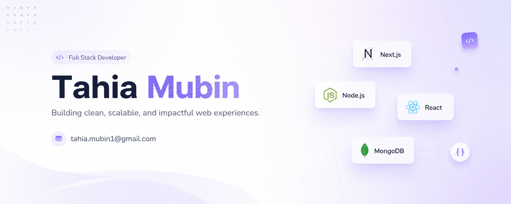

 

### About Me

Hey, I'm **Tahia Mubin** 👋 — a full-stack developer based in Sylhet, Bangladesh.

- 🔭 Right now I'm building with **Next.js**, **React**, and **Node/Express**
- 🗃️ **MongoDB** is my go-to for data modeling
- 🧠 Currently I'm learning Typescript
- 📬 Reach out any time — details below

 

### Where to Find Me

  
  
  

 

### What I Work With

| Category | Stack |
|---|---|
| Languages |     |
| Frontend |     |
| Backend |   |
| Database |   |
| Tooling |     |

 

### Activity Snapshot

  

  
  

  

 

  

